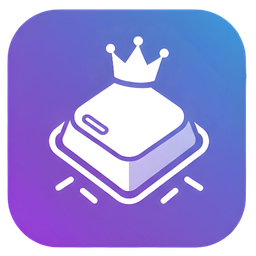
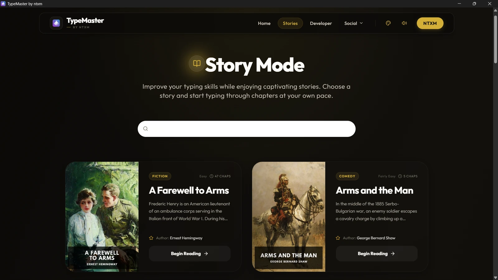
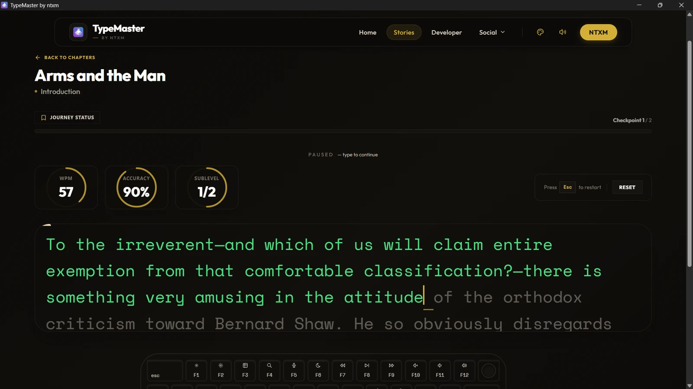
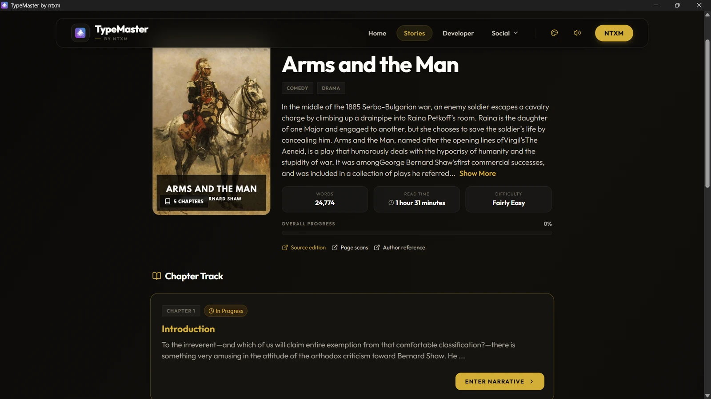
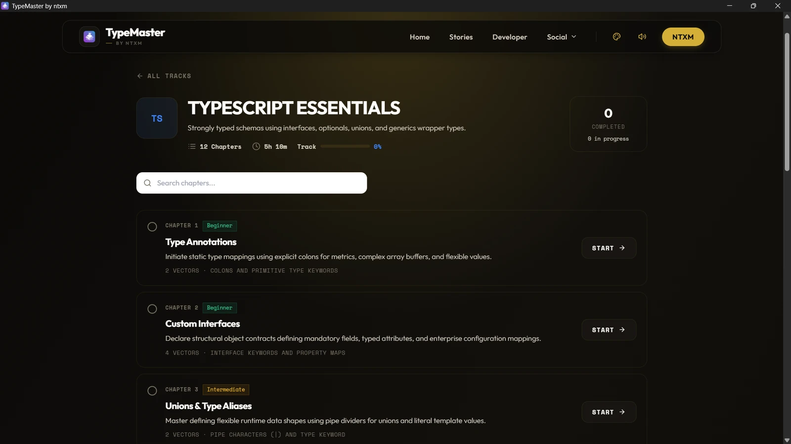
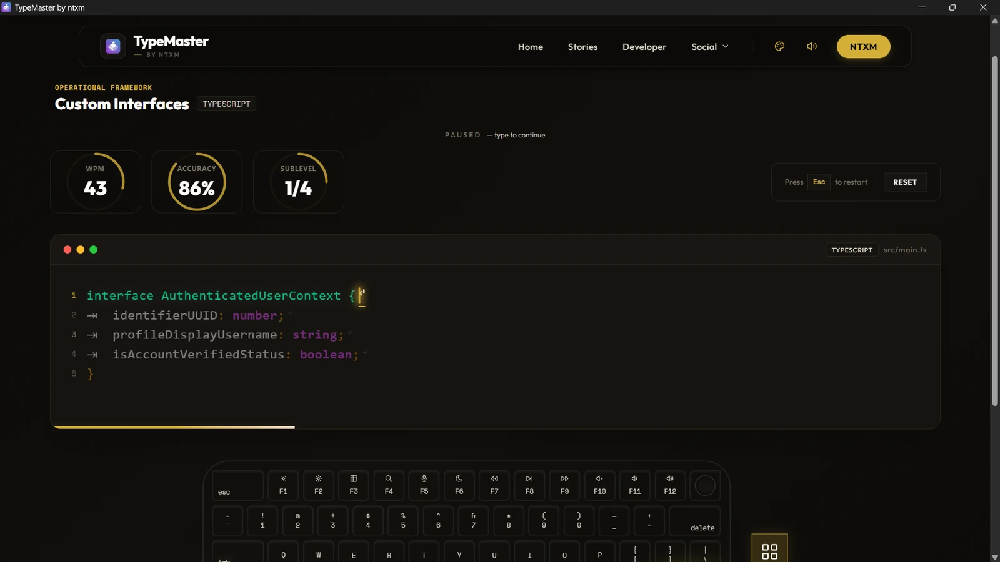

<div align="center">



# TypeMaster

### Learn to type by typing real books. Fully offline.

**1,456 classic stories ship inside the app.** No daily cap, no trial, no paywall, no login.<br/>
Desktop app for Windows. macOS is not available yet.

<br/>

[](https://github.com/typemaster-by-ntxm/typemaster/releases/tag/v0.1.2)
[](#download)
[](#privacy-and-offline)
[](#the-story-library)
[](#why-typemaster)
[](#licence)

<p>
  <a href="#download"><b>Download</b></a> &nbsp;|&nbsp;
  <a href="#why-typemaster"><b>Why</b></a> &nbsp;|&nbsp;
  <a href="#features"><b>Features</b></a> &nbsp;|&nbsp;
  <a href="#screenshots"><b>Screenshots</b></a> &nbsp;|&nbsp;
  <a href="#install"><b>Install</b></a> &nbsp;|&nbsp;
  <a href="#privacy-and-offline"><b>Privacy</b></a> &nbsp;|&nbsp;
  <a href="#faq"><b>FAQ</b></a>
</p>

<br/>



<p><sub>Story Mode: search the library, pick a book, type it chapter by chapter.</sub></p>

</div>

---

## Download

<div align="center">

[-7c5cff?style=for-the-badge&logo=windows&logoColor=white)](https://github.com/typemaster-by-ntxm/typemaster/releases/download/v0.1.2/TypeMaster_0.1.2_x64_en-US.msi)

</div>

| Platform | File | Size | Requires |
|:---------|:-----|-----:|:---------|
| **Windows** | [`TypeMaster_0.1.2_x64_en-US.msi`](https://github.com/typemaster-by-ntxm/typemaster/releases/download/v0.1.2/TypeMaster_0.1.2_x64_en-US.msi) | about 500 MB (525,088,150 bytes) | 64-bit Windows. About 1.4 GB free disk space |
| **macOS** | Not available yet | | No Mac build has been released |
| **All** | [Release page for v0.1.2](https://github.com/typemaster-by-ntxm/typemaster/releases/tag/v0.1.2) | | Every file of this version |

The download is large because all 1,456 stories are inside the installer. That is also why it works without internet.

**SHA-256 checksum** (compare it with your download before you run it):

```text
6ceb838d32434452571fcb0af503d62270cb68b8b30e38cdbba43036111bbe67  TypeMaster_0.1.2_x64_en-US.msi
```

```text
Windows (Command Prompt):  certutil -hashfile TypeMaster_0.1.2_x64_en-US.msi SHA256
Windows (PowerShell):      Get-FileHash .\TypeMaster_0.1.2_x64_en-US.msi -Algorithm SHA256
```

> [!NOTE]
> The installer is **not code-signed** yet. Windows SmartScreen will probably show a warning the first time. That is expected, and the steps to continue are in [Install](#install).

TypeMaster is **free to download and use**. It is proprietary software, not open source: see [Licence](#licence).

---

## Why TypeMaster

Most typing tutors give you random letters or random words. TypeMaster gives you **real books**: you retype classic literature one chapter at a time, so you practise punctuation, vocabulary and rhythm while you read something worth reading.

| The usual way | With TypeMaster |
|:--------------|:----------------|
| Random word drills that feel like homework | Retype classic novels, plays and essays chapter by chapter |
| Needs a browser and a connection | **Works offline.** All 1,456 stories are installed with the app |
| Daily limits, trials, paid levels or an account | **No daily cap, no trial, no paywall, no login** |
| Your history lives on someone else's server | Progress is saved in a file on your own PC |

There is also a free [web version](https://typemaster.ntxm.org/) if you want to try TypeMaster in a browser first.

---

## Features

<table>
<tr>
<td width="50%" valign="top">

**Story Mode**<br/>
1,456 stories with search by title or author. Each card shows the cover, genre, difficulty, chapter count and a short description.

**Live WPM and accuracy**<br/>
Rings show your speed and accuracy while you type, with a progress count for the current part of the chapter. Press <kbd>Esc</kbd> to restart.

**Typing levels**<br/>
30 levels with 569 sublevels, starting at the home row (F and J) and building up.

</td>
<td width="50%" valign="top">

**Coding practice**<br/>
Tracks for TypeScript, JavaScript, Python, C++, HTML and CSS, and SQL, plus a place to paste your own code.

**On-screen keyboard**<br/>
A visual keyboard under the text, in a full or a compact layout.

**Themes and sound**<br/>
Five colour themes (Obsidian, Clay, Moss, Gold, Porcelain) and optional key-press and wrong-key sounds with separate volumes.

**Remembers your place**<br/>
Progress for levels, stories and coding lessons is stored locally and survives restarts.

</td>
</tr>
</table>

---

## The story library

The library has **1,456 stories**. That number is counted from the data files that ship in the app, and the app shows it on the Story Mode screen ("1,456 stories available").

| | |
|:--|:--|
| **Stories** | 1,456 (every one has its own text file inside the app) |
| **Chapters** | about 67,900 in total |
| **Authors** | about 650 |
| **Language** | English (US 524, UK 921, other English 11) |
| **Source** | Edition and book details from [Standard Ebooks](https://standardebooks.org/), with links to the source edition and page scans on each story page |

Examples you can find in the library: *A Farewell to Arms*, *Arms and the Man*, *We* by Charles A. Lindbergh, *813*, *A Bid for Fortune*. Use the search box to find a title or an author.

---

## Screenshots

<table>
<tr>
<td width="50%" valign="top" align="center">
<br/>
<sub><b>Typing a story.</b> WPM, accuracy and progress rings, correct text in green, on-screen keyboard.</sub>
</td>
<td width="50%" valign="top" align="center">
<br/>
<sub><b>Story page.</b> Description, word count, reading time, difficulty, progress and chapters.</sub>
</td>
</tr>
<tr>
<td width="50%" valign="top" align="center">
<br/>
<sub><b>Coding tracks.</b> Lessons for TypeScript and five more languages.</sub>
</td>
<td width="50%" valign="top" align="center">
<br/>
<sub><b>Typing code.</b> Real syntax in an editor-style panel.</sub>
</td>
</tr>
</table>

<sub>All screenshots are of TypeMaster 0.1.2 on Windows, using the Gold theme.</sub>

---

## Install

### Windows

1. [Download the installer](https://github.com/typemaster-by-ntxm/typemaster/releases/download/v0.1.2/TypeMaster_0.1.2_x64_en-US.msi) and (optionally) check its [SHA-256](#download).
2. Make sure you have about 1.4 GB of free disk space.
3. Double-click the `.msi` file. If Windows shows **"Windows protected your PC"** (SmartScreen, because the installer is not code-signed yet), click **More info**, then **Run anyway**.
4. Follow the installer, then start **TypeMaster** from the Start menu.

### macOS

There is **no macOS build yet**. Nothing is promised for a date. Watch the [releases page](https://github.com/typemaster-by-ntxm/typemaster/releases) if you want to know when that changes. In the meantime the [web version](https://typemaster.ntxm.org/) runs in any browser.

### System requirements

| | Windows |
|:--|:--------|
| **System** | 64-bit Windows. Tested on Windows 11. Other Windows versions are not tested |
| **Disk space** | About 1.4 GB after installation (the stories are most of it) |
| **Web view** | The Microsoft Edge WebView2 Runtime, which is built into Windows 11. If it is missing, the installer may need to fetch it once |
| **Network** | Not needed to use the app |

### Uninstall

Settings > Apps > Installed apps > TypeMaster > Uninstall. Your progress file lives in your user profile (see [Where your data lives](#where-your-data-lives)); delete that folder yourself if you also want to erase your progress.

---

## Privacy and offline

<div align="center">

| | |
|:--|:--|
| **Works offline** | Stories, levels, coding lessons, covers and sounds are all inside the app. Typing, progress and settings need no connection |
| **No account** | No sign-up, no login, no email address, no trial |
| **Your progress stays local** | Speed, accuracy and progress are saved on your PC and are never uploaded |

</div>

To be exact about the network, so there are no surprises. These are the only two things that happen **when you are online**:

1. **A launch counter.** Each time the app starts, it sends one anonymous request to `typemaster.ntxm.org` so ntxm.org can count desktop launches. The address contains only `app=desktop`. It does not carry your typing, your progress, your name or any ID. As with any web request, the server can see your IP address. If you are offline the request simply fails and nothing else changes.
2. **Google Fonts.** The interface asks `fonts.googleapis.com` for its fonts. Offline, Windows uses its own fonts instead, so the text can look a little different but everything works.

Also: links such as the ones under **Social** open in your normal web browser when you click them.

What the app does **not** do: no analytics or tracking inside the app, no ads, no account, no update checker (new versions are not announced inside the app, so watch the [releases page](https://github.com/typemaster-by-ntxm/typemaster/releases)).

If you want a hard guarantee, block TypeMaster in Windows Firewall. Both items above are optional extras and the app does not depend on them. This description comes from reading the source code of version 0.1.2, not from a sandbox test.

Details: [PRIVACY.md](PRIVACY.md) | [TERMS.md](TERMS.md) | [LICENSE](LICENSE)

### Where your data lives

| What | Where on Windows |
|:-----|:-----------------|
| Progress and settings (theme, sound volumes, keyboard layout) | A small file in `%APPDATA%\org.ntxm.typemaster` |
| Web view cache | `%LOCALAPPDATA%\org.ntxm.typemaster` |

You can look at these folders, copy them or delete them at any time.

---

## FAQ

<details>
<summary><b>Is TypeMaster really free?</b></summary>
<br/>
Yes. The app is free to download and use, with no subscription, no in-app purchases, no ads and no account. It is proprietary software, so the source code is not public. See <a href="#licence">Licence</a>.
</details>

<details>
<summary><b>Does it really work without internet?</b></summary>
<br/>
Yes. All 1,456 stories, the levels and the coding lessons are installed with the app. The only network activity is the optional launch counter and the Google Fonts request described in <a href="#privacy-and-offline">Privacy and offline</a>, and neither is needed to type.
</details>

<details>
<summary><b>What does "no limit" mean?</b></summary>
<br/>
There is no daily cap, no time limit, no trial period, no paywall and no login in the app. You can type as many stories, chapters and sessions as you like.
</details>

<details>
<summary><b>Why does Windows warn me when I run the installer?</b></summary>
<br/>
The installer is not code-signed yet, so SmartScreen does not know the publisher. Click <b>More info</b>, then <b>Run anyway</b>. You can check the SHA-256 in <a href="#download">Download</a> first to be sure the file is the official one.
</details>

<details>
<summary><b>Why is the download about 500 MB?</b></summary>
<br/>
Because the whole library of 1,456 stories, with covers, is bundled so that the app does not need the internet. After installation it uses about 1.4 GB.
</details>

<details>
<summary><b>Is there a Mac version?</b></summary>
<br/>
Not yet. Only the Windows installer has been released. You can use the <a href="https://typemaster.ntxm.org/">web version</a> on a Mac.
</details>

<details>
<summary><b>Is it open source?</b></summary>
<br/>
No. TypeMaster is proprietary. This repository is a release and showcase page with documentation and images, not the source code. See <a href="LICENSE">LICENSE</a>.
</details>

<details>
<summary><b>How do I update?</b></summary>
<br/>
The app does not check for updates. Download the newer installer from the <a href="https://github.com/typemaster-by-ntxm/typemaster/releases">releases page</a> and run it.
</details>

<details>
<summary><b>Where is my progress saved, and can I move it to another PC?</b></summary>
<br/>
In a local file in <code>%APPDATA%\org.ntxm.typemaster</code>. The app has no cloud sync. Copying that folder is the manual way to keep a backup.
</details>

<details>
<summary><b>Can I put the installer on my own website?</b></summary>
<br/>
Please link to this page or to the release instead of re-hosting the file. For anything else, read <a href="LICENSE">LICENSE</a> or write to <a href="mailto:contact@ntxm.org">contact@ntxm.org</a>.
</details>

---

## Known limitations

Being straight about what 0.1.2 does not do:

- **Windows only.** No macOS or Linux build has been released.
- **Unsigned installer.** SmartScreen will warn you on first run.
- **Large.** About 500 MB to download and about 1.4 GB installed.
- **English stories only.**
- **Network extras.** One anonymous launch counter request and Google Fonts when you are online (see [Privacy and offline](#privacy-and-offline)).
- **No automatic updates.**
- **Early release.** This is a 0.1.x version tested on Windows 11. Please report problems.

---

## What's new in 0.1.2

*Released 2026-10-03.*

- The story library grew to **1,456 stories**.
- Story sublevels are larger.
- Fixed word wrapping in the typing area.
- This is the single-user edition for Windows, installed with an MSI.

Full history: [CHANGELOG.md](CHANGELOG.md).

---

## Support

| | |
|:--|:--|
| **Questions and bugs** | [Open an issue](https://github.com/typemaster-by-ntxm/typemaster/issues/new/choose) (please do not attach private files) |
| **Email** | [contact@ntxm.org](mailto:contact@ntxm.org) |
| **Security reports** | [SECURITY.md](SECURITY.md) |
| **Product page** | [ntxm.org/products/typemaster](https://ntxm.org/products/typemaster/) |
| **Web version** | [typemaster.ntxm.org](https://typemaster.ntxm.org/) |

---

## Licence

TypeMaster is **proprietary software**, Copyright (c) 2026 ntxm. All rights reserved. **This repository is a release and showcase page: it contains documentation, images and policies, not the source code.**

| You may | You may not |
|:--------|:------------|
| Download and use the pre-built app for free | Use, copy, modify, publish or distribute the source code |
| Use the pre-built binaries | Create derivative works from the source code |
| | Reverse engineer the compiled application |

The software is provided "as is", without warranty. The legally binding text is [LICENSE](LICENSE). A public repository does not make this open source.

---

<div align="center">


**TypeMaster** 0.1.2 is made by **[ntxm.org](https://ntxm.org)**

Type real books. Offline.

[Download](#download) | [Releases](https://github.com/typemaster-by-ntxm/typemaster/releases) | [Web version](https://typemaster.ntxm.org/) | [Privacy](PRIVACY.md) | [Licence](LICENSE) | [ntxm.org](https://ntxm.org)

<sub>(c) 2026 ntxm. TypeMaster is a product name of ntxm.org.</sub>

</div>
